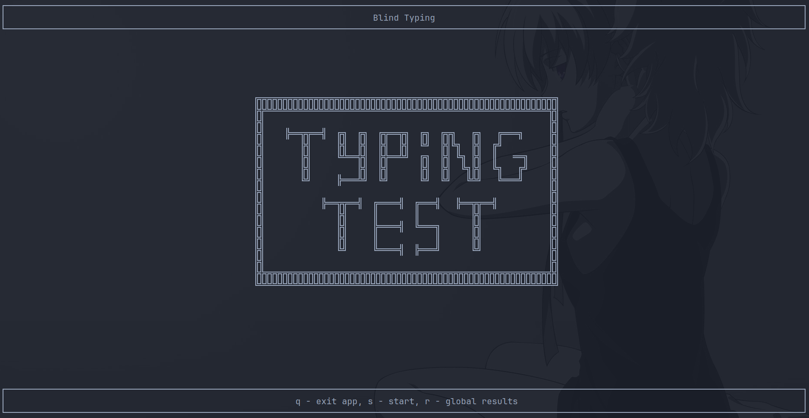

# Blind typing Test

Hi there, I have tryed to improve my blind typing powers, and have found some usefull websites, but theyy were not perfect for me. Because of that I have made my own blind typing app in Rust.

## Installation

I think, that this should work (you need a rust installed on your machine):
- `git clone https://github.com/Happyigr/Blind-typing`
- `cd in the folder of the project`
- `cargo run`

## Why rust?

I have heard a lot about rust, and I wanted to learn it. I have read the Rust book, but i want to tr, to implement smth useful. Because of it I wanted to make my own project, that i can show on my job or my friends.

## Plans

I want to implement both of versions of my app: TUI and GUI (with tauri).

- [x] - make the working terminal app, with all the screens
- [x] - the text to it (hints for keys) and the movement from screen to screen.
- [x] - the main logic of the app
- [x] - results after typing
- [x] - better results after typing (no JSON)
- [ ] - text getting from other resources
- [ ] - dynimacly results when typing with colored keyboard, that shows taps on keyboard
- [ ] - global results of all the typing tests
- [x] - global results by letter
- [ ] - better ui
- [ ] - error handling

GUI app:
- [ ] - make the working website with tauri
- [ ] - Main, Results, Typing screens
- [ ] - typing process
- [ ] - results after typing
- [ ] - dynamic results in typing mode
- [ ] - global results
- [ ] - results for every letter

## Thanks for

- ChatGPT :)
- https://docs.rs/ratatui/latest/ratatui/index.html
- https://www.keybr.com/
- https://doc.rust-lang.org/stable/book/
